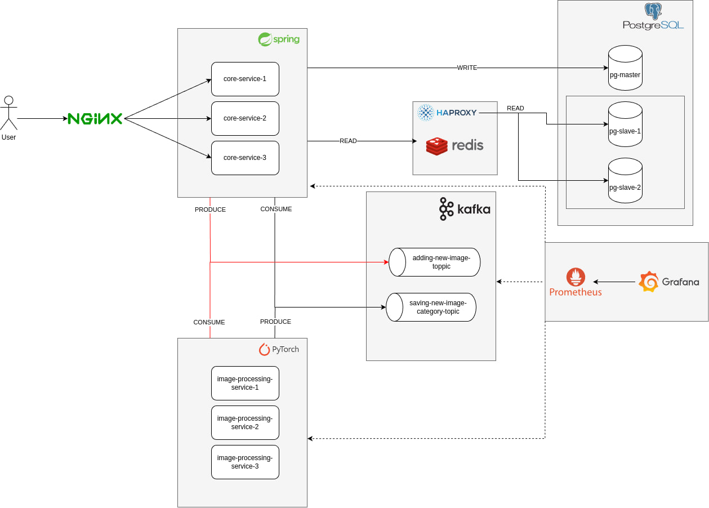

# Development of highload digital assets management and image recognition system

### Deployment:
To start an application run the following command:
```shell
docker-compose up
```
Postgres is configured with async replication by default.
So you need to do backup from master and configure replicas using examples in docker/postgres or use only master. 
If you choose only master instance for postgres, you have to exclude replicas hosts from haproxy.cfg and set env READ_ONLY_SLAVE_ENABLED to false in core-service.env  
